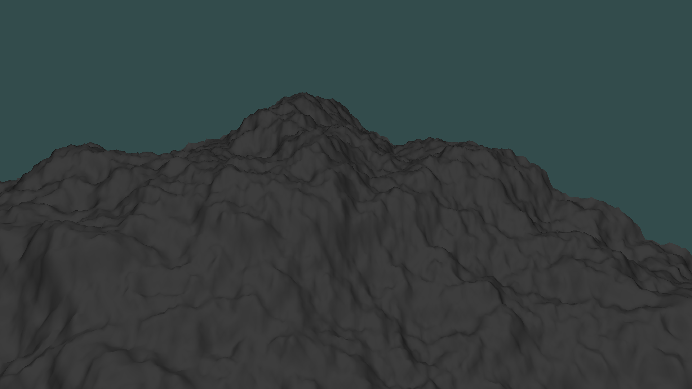

# Terrain
A program for renderering a 3d terrain.

## How to use

Most dependencies are includes in the src directory, however OpenGL is neeeded.

## What it does

Generates a 3d terrain using 2d noise for heightmapping. The terrain loading algorith can be configured with parameters for noise amplitudes and size. Also includes a moving light source and shaders to  illuminate the environment.

Below is an example of the loaded terrain:

## How it works

The heightmap is generated using noise. Triangles are then used the give the points a plane. A normal is also calculated for each point of the heightmap. This normal differs between points and gives the smooth look when it's rendered using light.

The math used is mostly homemade.
Camera and keybinds are boilerplate OpenGL.